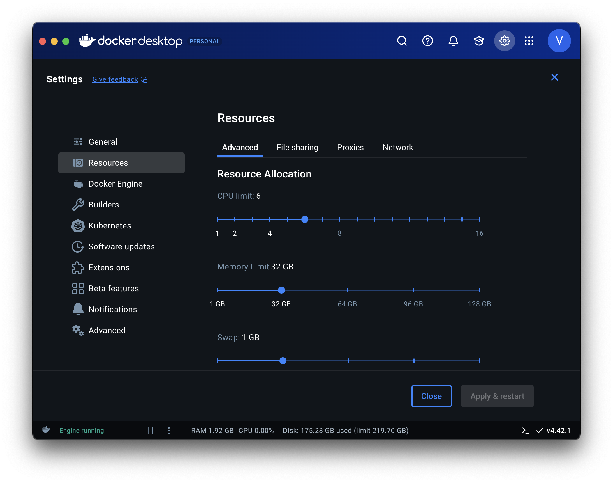
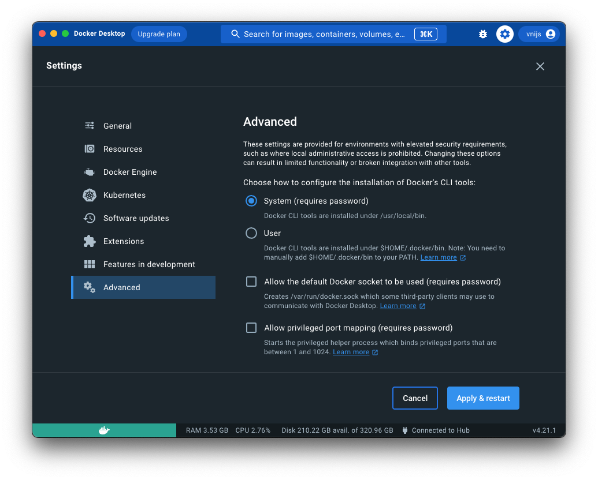

# Installing the RSM-MSBA computing environment on macOS (ARM)

## Install Docker Desktop

Please follow the instructions below to install the RSM-MSBA computing environment. It has Python, Radiant, Postgres, Spark and various required packages pre-installed. The computing environment will be consistent across all students and faculty, easy to update, and also easy to remove if desired (i.e., there will _not_ be dozens of pieces of software littered all over your computer).

Install Docker Desktop from the link below and make sure it is running. You will know it is running if you see the icon below at the top-right of your screen. If the containers in the image are moving up and down docker hasn't finished starting up yet.


[download and install Docker Desktop for macOS with an ARM chip (e.g., M3 or M4)](https://desktop.docker.com/mac/stable/arm64/Docker.dmg)

You should change the (maximum) resources Docker Desktop is allowed to use on your system. We recommend you set this to approximately 50% of the maximum available on your system (see screenshot below).



You should also go to the "Advanced" tab in _Docker Desktop > Settings_ and configure the installation of the Command Line Interface (CLI). Set it to "System" as shown in the screenshot below and click on the "Apply & Restart".



> Note: This video gives a brief (100 seconds) introduction to what Docker is: [https://www.youtube.com/watch?v=Gjnup-PuquQ](https://www.youtube.com/watch?v=Gjnup-PuquQ)

## Install macOS command line developer tools

You will need the macOS command line developer tools for the next steps. Open a terminal, run the code below, and follow the prompts until the software is installed.

```bash
xcode-select --install;
```

## Install VS Code

Microsoft's open-source Integrated Development Environment (IDE), VS Code or Visual Studio Code, is the most popular development environment according to a [Stack Overflow developer survey](https://survey.stackoverflow.co/2024/technology#most-popular-technologies-webframe). VS Code is widely used by Google developers and is the [default development environment at Facebook](https://www.zdnet.com/article/facebook-microsofts-visual-studio-code-is-now-our-default-development-platform/).

VS Code can be installed from the link below and is an excellent editor for Python, SQL, JavaScript, R, and many other programming languages.

<a href="https://code.visualstudio.com/docs/?dv=darwinarm64" target="_blank">https://code.visualstudio.com/docs/?dv=darwinarm64</a>

Run the code below from a terminal on macOS after installing VS Code to install relevant extensions:

```bash
source <(curl -s https://raw.githubusercontent.com/radiant-rstats/docker-k8s/refs/heads/main/vscode/extension-install.sh)
```

If you get a "code: command not found" error when trying to launch VS Code from a terminal, follow the instructions below to add VS Code to your path:

[https://code.visualstudio.com/docs/setup/mac#\_launching-from-the-command-line](https://code.visualstudio.com/docs/setup/mac#_launching-from-the-command-line)

To learn more about using VS Code to write Python code, see the links and comments below.

- <a href="https://code.visualstudio.com/docs/languages/python" target="_blank">Python in VS Code</a>
- <a href="https://code.visualstudio.com/docs/python/python-tutorial#_create-a-python-hello-world-source-code-file" target="_blank">VS Code Python Tutorial</a>

You can even create and run Jupyter Notebooks in VS Code:

- <a href="https://code.visualstudio.com/docs/datascience/jupyter-notebooks" target="_blank">Jupyter Notebooks in VS Code</a>

A major feature in VS Code is the ability to use AI to help you write code. For more information see the link below:

<a href="https://code.visualstudio.com/docs/copilot/overview" target="_blank">VS Code Copilot</a>

## Use the RSM-VSCODE extension

- Press `CMD-Shift-P` to open the command palette in VS Code. Then type "RSM: " to see the different tools that are available through this VS Code extension

## Setup the computing environment

In a terminal run the following command:

```bash
docker pull vnijs/rsm-msba-k8s:latest
```

After that first run, you will be able to use `RSM: Update Docker Image` in the VS Code Command Palette.

Now connect VS Code to the docker container for a specific workspace by using "RSM: Change Workspace". When you have selected the folder (workspace) you want to work in, use "RSM: Attach to Container" to attached VS Code to the docker container.

The final steps are:

- Run the `setup` and `github`commands in a VS Code terminal.
- In the command pallette use "RSM: Merge Keybindings" and "RSM: Merge Settings"

## Using UV

The RSM-MSBA docker image uses UV for Python package management, virtual environments, and installing different versions of Python. To learn more about UV see `<a href="https://docs.astral.sh/uv/" target="_blank">`https://docs.astral.sh/uv/`</a>`.
It is important to realize that the RSM-MSBA docker container will reset itself completely when it is restarted (i.e., it always starts from the same docker image). This means that we can install Python packages that will **not** persist after restarting the docker container, which can be convenient if we want to experiment without worrying about "breaking" anything. To add to the main Python environment inside the docker container, we can enter code like the below from a terminal in VS Code:

```bash
cd /opt/base-uv/;
source .venv/bin/activate
uv add mlxtend;
```

> Note: After installing a package you may need to restart any running Python kernels so you can `import` the new package in a Jupyter Notebook, for example.

### Creating a virtual environment

You can also use UV to install packages you might need for a specific project or class in a way that **will** persist even if you restart the docker container. For example, you can use the sequence of commands below to create a virtual (Python) environment in a project folder and install a specific version of the `polars` package.

First create a new directory for your project

```bash
# rm -rf ~/my_project; # for cleanup if you want to try this multiple times
mkdir ~/my_project;
cd ~/my_project;
```

Make sure no other virtual environment is active in the project folder, then initialize the project folder, create a virtual Python environment, and `activate` it.

```bash
deactivate;
uv init .;
uv venv --python 3.12;
source .venv/bin/activate;
```

Now we are ready to `add` Python packages to the environment that are needed for the project or class. In this case, we will install a specific version of polars and we will double-check that this version was indeed installed.

```bash
uv add polars==1.1.0;
python -c "import polars as pl; print(pl.__version__)";
```

> Note: The `-c` argument in the code block above allows a (small) Python program to be passed in as a string. Use `python --help` to see all the Python options.

### Removing a virtual environment

To remove a virtual environment from a project directory you can use the following code:

```bash
cd ~/my_project;
rm -rf .venv
rm README.md main.py pyproject.toml uv.lock
rm -rf .git .gitignore .python-version
```

You could, of course, also delete the entire project folder using `rm -rf ~/my_project` if you don't need it anymore.

## Cleanup

If you want a full cleanup and reset of the computational environment on your system, however, execute the following commands from a macOS terminal to remove all Docker images, networks, and (data) volumes, and _pull_ only the specific Docker image you need:

```bash
rm -rf ~/.rsm-msba;
docker system prune --all --volumes --force;
docker pull vnijs/rsm-msba-k8s;
```

## Troubleshooting

The only issues we have seen on macOS so far can be addressed by restarting Docker and/or restarting your computer.
