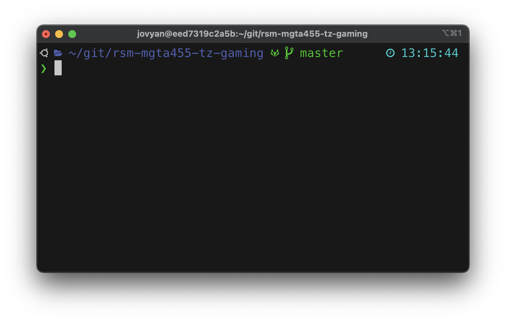

# Contents

- [Contents](#contents)
  - [Installing the RSM-MSBA-K8S-ARM computing environment on macOS systems with an ARM chip (e.g., M3 or M4)](#installing-the-rsm-msba-k8s-arm-computing-environment-on-macos-systems-with-an-arm-chip-eg-m3-or-m4)
  - [Updating the RSM-MSBA-K8S-ARM computing environment on macOS systems with an ARM chip](#updating-the-rsm-msba-k8s-arm-computing-environment-on-macos-systems-with-an-arm-chip)
  - [Using VS Code](#using-vs-code)
  - [Installing Python and R packages locally](#installing-python-and-r-packages-locally)
    - [Using pip to install python packages](#using-pip-to-install-python-packages)
    - [Removing locally installed packages](#removing-locally-installed-packages)
  - [Committing changes to the computing environment](#committing-changes-to-the-computing-environment)
  - [Cleanup](#cleanup)
  - [Getting help](#getting-help)
  - [Trouble shooting](#trouble-shooting)
  - [Optional](#optional)

## Installing the RSM-MSBA-K8S-ARM computing environment on macOS systems with an ARM chip (e.g., M3 or M4)

Please follow the instructions below to install the rsm-msba-k8s-arm computing environment. It has Python, Radiant, Postgres, Spark and various required packages pre-installed. The computing environment will be consistent across all students and faculty, easy to update, and also easy to remove if desired (i.e., there will *not* be dozens of pieces of software littered all over your computer).

**Step 1**: Install docker from the link below and make sure it is running. You will know it is running if you see the icon below at the top-right of your screen. If the containers in the image are moving up and down docker hasn't finished starting up yet.


[download and install docker for macOS with an ARM chip (e.g., M3 or M4)](https://desktop.docker.com/mac/stable/arm64/Docker.dmg)

You should change the (maximum) resources docker is allowed to use on your system. We recommend you set this to approximately 50% of the maximum available on your system.


<!--
You should also go to the "Advanced" tab and configure the installation of the Command Line Interface (CLI). Set it to "System" as shown in the screenshot below and click on the "Apply & Restart".


-->

> Note: This video gives a brief intro (100 seconds) to what Docker is: <https://www.youtube.com/watch?v=Gjnup-PuquQ>{target="_blank"}

**Step 2**: Open a terminal and copy-and-paste the code below

Get [iTerm2](https://iterm2.com/downloads.html){target="_blank"} and install it.

You will need the macOS command line developer tools for the next steps. Open an iTerm2 terminal, run the code below, and follow the prompts until the software is installed.

```bash
xcode-select --install;
```

**Step 3**: Setup RSM-MSBA computing environment by copy-and-pasting the code below into an iTerm2 terminal.

```bash
git clone https://github.com/radiant-rstats/docker-k8s.git ~/git/docker-k8s;
cp -p ~/git/docker-k8s/launch-rsm-msba-k8s-arm.sh ~/Desktop/launch-rsm-msba.command;
~/Desktop/launch-rsm-msba.command;
```

This step will clone and start up a script that will finalize the installation of the computing environment. The first time you run this script it will download the latest version of the computing environment which can take some time. Wait for the container to download and follow any prompts. Once the download is complete you should see a menu as in the screenshot below.


The code above also copies the file `launch-rsm-msba-k8s-arm.sh` to `launch-rsm-msba.command` on your Desktop. You will be able to double-click this file to start the container again in the future.

Alternatively, you can run the command below to launch the docker container from a terminal (i.e., iTerm2).

```bash
~/git/docker-k8s/launch-rsm-msba-k8s-arm.sh -v ~;
```

**Step 4**: Check that you can launch Radiant

You will know that the installation was successful if you can start Radiant. If you press 2 (+ Enter) Radiant should start up in your default web browser.

> Important: Always use q (+ Enter) to shutdown the computing environment


To finalize the setup, open a terminal inside the docker container by pressing `1` and `Enter` in the launch menu. Then run the command below and follow any prompts:

```bash
setup;
```

When the setup process is done, type `exit` and press enter to return to the launch menu.

## Updating the RSM-MSBA-K8S-ARM computing environment on macOS systems with an ARM chip

To update the container press 3 (+ Enter) in the launch menu. To update the launch script itself, press 4 (+ Enter) in the launch menu.


If for some reason you are having trouble updating either the container or the launch script, open a terminal and copy-and-paste the code below. These commands will update the docker container, replace the old docker related scripts, and copy the latest version of the launch script to your Desktop.

```bash
docker pull vnijs/rsm-msba-k8s-arm;
rm -rf ~/git/docker*;
git clone https://github.com/radiant-rstats/docker-k8s.git ~/git/docker-k8s;
cp -p ~/git/docker-k8s/launch-rsm-msba-k8s-arm.sh ~/Desktop/launch-rsm-msba.command;
```

## Using VS Code

Microsoft's open-source Integrated Development Environment (IDE), VS Code or Visual Studio Code, is the most popular development environment according to a [Stack Overflow developer survey](https://survey.stackoverflow.co/2024/technology#most-popular-technologies-webframe). VS Code is widely used by Google developers and is the [default development environment at Facebook](https://www.zdnet.com/article/facebook-microsofts-visual-studio-code-is-now-our-default-development-platform/).

VS Code can be installed from the link below and is an excellent editor for Python, SQL, Javascript, R, and many other programming languages.

<a href="https://code.visualstudio.com/download" target="_blank">https://code.visualstudio.com/download</a>

Run the code below from a terminal on macOS after installing VS Code to install relevant extensions:

```bash
cd ~/git/docker-k8s/vscode;
./extension-install.sh;
cd -;
```

If you get a "code: command not found" error when trying to launch VS Code from a terminal, follow the instructions below to add VS Code to your path:

<https://code.visualstudio.com/docs/setup/mac#_launching-from-the-command-line>

To learn more about using VS Code to write python code see the links and comments below.

- <a href="https://code.visualstudio.com/docs/languages/python" target="_blank">Python in VS Code</a>
- <a href="https://code.visualstudio.com/docs/python/python-tutorial#_create-a-python-hello-world-source-code-file" target="_blank">VS Code Python Tutorial</a>

Note that you can use `Shift+Enter` to run the current line in a Python Interactive Window:

- <a href="https://code.visualstudio.com/docs/python/jupyter-support-py" target="_blank">Executing Python Code in VS Code</a>

When writing and editing python code you will have access to tools for auto-completion, etc. Your code will also be auto-formatted every time you save it using the "black" formatter.

- <a href="https://code.visualstudio.com/docs/python/editing" target="_blank">Editing Python in VS Code Python</a>

VS Code also gives you access to a debugger for your python code. For more information see the link below:

- <a href="https://code.visualstudio.com/docs/python/debugging" target="_blank">Debugging Python in VS Code Python</a>

You can even open and run Jupyter Notebooks in VS Code

- <a href="https://code.visualstudio.com/docs/datascience/jupyter-notebooks" target="_blank">Jupyter Notebooks in VS Code</a>

A major new feature in VS Code is the ability to use AI to help you write code. For more information see the links below:

- <a href="https://code.visualstudio.com/docs/copilot/overview" target="_blank">VS Code Copilot</a>

## Installing Python and R packages locally

To install the latest version of R-packages you need, add the lines of code shown below to `~/.Rprofile`. You can edit the file by running `code ~/.Rprofile` in a VS Code terminal.

```r
if (Sys.info()["sysname"] == "Linux") {
  options(repos = c(
    RSPM = "https://packagemanager.posit.co/cran/__linux__/noble/latest",
    CRAN = "https://cloud.r-project.org"
  ))
} else {
  options(repos = c(
    CRAN = "https://cloud.r-project.org"
  ))
}
```

This will be done for you automatically if you run the `setup` command from a terminal inside the docker container. To install R packages that will persist after restarting the docker container, enter code like the below in R and follow any prompts. After doing this once, you can use `install.packages("some-other-package")` to install packages locally in the future.

```r
fs::dir_create(Sys.getenv("R_LIBS_USER"), recurse = TRUE)
install.packages("fortunes", lib = Sys.getenv("R_LIBS_USER"))
```

To install Python modules that will **not** persist after restarting the docker container, enter code like the below from a terminal in VS Code:

```bash
pip install pyasn1
```

After installing a module you will have to restart any running Python kernels to `import` the module in your code.

### Using pip to install python packages

We recommend you use `pip` to install any additional packages you might need. For example, you can use the command below to install a new version of the `pyrsm` package that you will use regularly throughout the Rady MSBA program. Note that adding `--user` is important to ensure the package is still available after you restart the docker container

```bash
pip install --user --upgrade pyrsm
```

### Removing locally installed packages

To remove locally installed R packages press 6 (and Enter) in the launch menu and follow the prompts. To remove Python modules installed locally using `pip` press 7 (and Enter) in the launch menu

## Committing changes to the computing environment

By default re-starting the docker computing environment will remove any changes you made. This allows you to experiment freely, without having to worry about "breaking" things. However, there are times when you might want to keep changes.

As shown in the previous section, you can install R and Python packages locally rather than in the container. These packages will still be available after a container restart.

To install binary R packages for Ubuntu Linux you can use the command below. These packages will *not* be installed locally and would normally not be available after a restart.

```bash
sudo apt update;
sudo apt install r-cran-ada;
```

Similarly, some R-packages have requirements that need to be installed in the container (e.g., the `rgdal` package). The following two linux packages would need to be installed from a terminal in the container as follows:

```bash
sudo apt update;
sudo apt install libgdal-dev libproj-dev;
```

After completing the step above you can install the `rgdal` R-package locally using the following from R:

`install.packages("rgdal", lib = Sys.getenv("R_LIBS_USER"))`

To save (or commit) these changes so they *will* be present after a (container) restart type, for example, `c myimage` (+ Enter). This creates a new docker image with your changes and also a new launch script on your Desktop with the name `launch-rsm-msba-myimage.command` that you can use to launch your customized environment in the future.

If you want to share your customized version of the container with others (e.g., team members) you can push it is to Docker Hub <a href="https://hub.docker.com" target="_blank">https://hub.docker.com</a> by following the menu dialog after typing, e.g., `c myimage` (+ Enter). To create an account on Docker Hub go to <a href="https://hub.docker.com/signup" target="_blank">https://hub.docker.com/signup</a>.

If you want to remove specific images from your computer run the commands below from a (bash) terminal. The first command generates a list of the images you have available.

`docker image ls;`

Select the IMAGE ID for the image you want to remove, e.g., `42b88eb6adf8`, and then run the following command with the correct image id:

`docker rmi 42b88eb6adf8;`

For additional resources on developing docker images see the links below:

- <https://colinfay.me/docker-r-reproducibility>
- <https://www.fullstackpython.com/docker.html>

## Cleanup

To remove any locally installed R-packages, press 6 (+ Enter) in the launch menu. To remove locally installed Python modules press 7 (+ Enter) in the launch menu.

> Note: It is also possible initiate the process of removing locally installed packages and settings from within the container. Open a terminal by pressing 1 (+ Enter) in the launch menu and typing `clean`. Then follow the prompts to indicate what needs to be removed.

You should always stop the `rsm-msba-k8s-arm` docker container using `q` (+ Enter) in the launch menu. If you want a full cleanup and reset of the computational environment on your system, however, execute the following commands from a (bash) terminal to (1) remove local R and Python packages, (2) remove all docker images, networks, and (data) volumes, and (3) 'pull' only the docker image you need (e.g., rsm-msba-k8s-arm):

```bash
rm -rf ~/.rsm-msba;
docker system prune --all --volumes --force;
docker pull vnijs/rsm-msba-k8s-arm;
```

## Getting help

Please bookmark this page in your browser for easy access in the future. You can also access the documentation page for your OS by typing h (+ Enter) in the launch menu. Note that the launch script can also be started from the command line (i.e., a bash terminal) and has several important arguments:

* `launch -t 3.0.0` ensures a specific version of the docker container is used. Suppose you used version 3.0.0 for a project. Running the launch script with `-t 3.0.0` from the command line will ensure your code still runs, without modification, years after you last touched it!
* `launch -v ~/rsm-msba` will treat the `~/rsm-msba` directory on the host system (i.e., your macOS computer) as the home directory in the docker container. This can be useful if you want to setup a particular directory that will house multiple projects
* `launch -d ~/project_1` will treat the `project_1` directory on the host system (i.e., your macOS computer) as the project home directory in the docker container. This is an additional level of isolation that can help ensure your work is reproducible in the future. This can be particularly useful in combination with the `-t` option as this will make a copy of the launch script with the appropriate `tag` or `version` already set. Simply double-click the script in the `project_1` directory and you will be back in the development environment you used when you completed the project
* `launch -s` show additional output in the terminal that can be useful to debug any problems
* `launch -h` prints the help shown in the screenshot below


## Trouble shooting

The only issues we have seen on macOS so far can be addressed by restarting docker and/or restarting your computer

## Optional

If you want to make your terminal look nicer and add syntax highlighting, auto-completion, etc. follow the install instructions linked below:

<https://github.com/radiant-rstats/docker-k8s/blob/main/install/setup-ohmyzsh.md>



To install a more feature-rich terminal for macOS see: <https://iterm2.com/>{target="_blank"}
