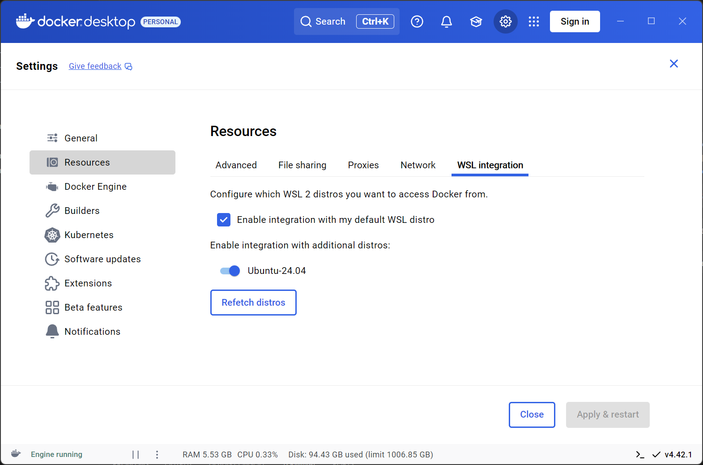
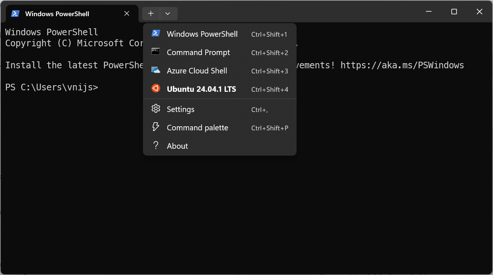
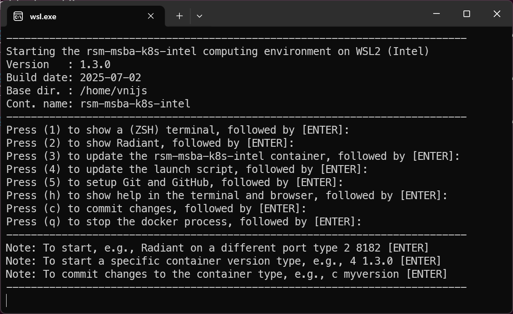
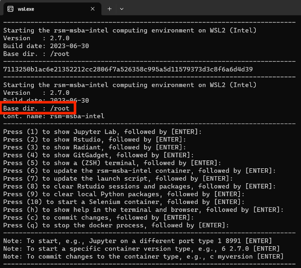
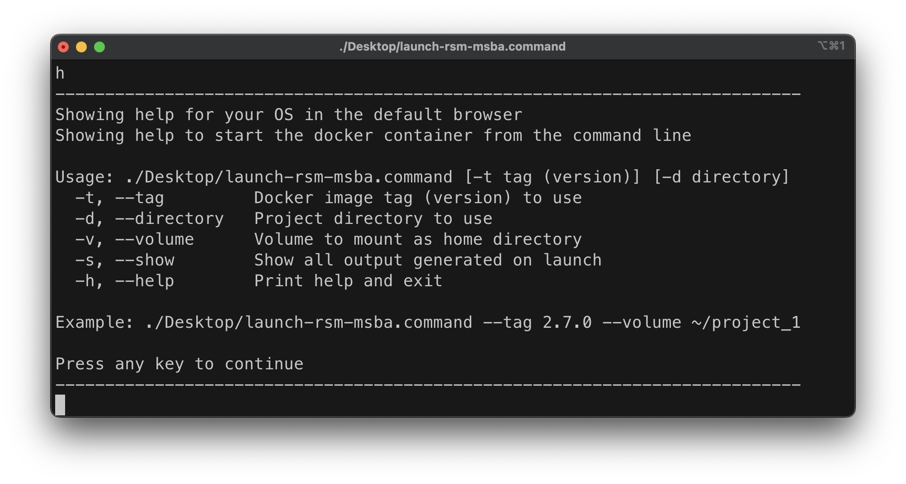

# RSM-MSBA on Windows (Intel)

- [RSM-MSBA on Windows (Intel)](#rsm-msba-on-windows-intel)
  - [Installing the RSM-MSBA computing environment](#installing-the-rsm-msba-computing-environment)
  - [Updating the RSM-MSBA computing environment](#updating-the-rsm-msba-computing-environment)
  - [Using VS Code](#using-vs-code)
  - [Using UV](#using-uv)
    - [Creating a virtual environment](#creating-a-virtual-environment)
    - [Removing a virtual environment](#removing-a-virtual-environment)
  - [Cleanup](#cleanup)
  - [Getting help](#getting-help)
  - [Trouble shooting](#trouble-shooting)
  - [Optional](#optional)

## Installing the RSM-MSBA computing environment

Please follow the instructions below to install the RSM-MSBA computing environment. It has Python, Radiant, Postgres, Spark and various required packages pre-installed. The computing environment will be consistent across all students and faculty, easy to update, and also easy to remove if desired (i.e., there will *not* be dozens of pieces of software littered all over your computer).

**Step 1**: Install Windows Subsystem for Linux (WSL2) and Ubuntu 24.04

To install WSL2 and Ubuntu 24.04, open **PowerShell as Administrator** (right-click the Start menu, select "Windows PowerShell (Admin)"). Then run the following command to install WSL and Ubuntu 24.04:

```bash
wsl --install -d Ubuntu-24.04
```


Restart your computer if prompted. When the Ubuntu terminal opens for the first time, you will be asked to create a Linux username and password. **Use your UCSD username** (e.g., `aaa111` if your @ucsd.edu email is `aaa111@ucsd.edu`) and choose a password you can remember (you will not see any characters as you type). Using your UCSD username helps ensure your files and settings are consistent across systems and makes it easier for instructors to help if you run into issues.

To check the installed distributions, i.e., versions of Linux, and the WSL version, run:

```bash
wsl -l -v
```

If Ubuntu 24.04 is not set as the default, set it with:

```bash
wsl --setdefault Ubuntu-24.04
```


You can check your username for Windows and Ubuntu by running `whoami` in both a Windows PowerShell and an Ubuntu terminal. If you see `root` as your username in Ubuntu, follow the troubleshooting steps below to set your username correctly. This is important for file access and to avoid issues later.


**Troubleshooting**

> **Important:** If you see `root` as your username in Ubuntu, you will need to reset your username. If the username in Ubuntu is as expected, you can proceed to **Step 2** below.


From an Ubuntu terminal, run the commands below (replace “your-id” with the username you want to use):

```bash
adduser your-id
sudo usermod -aG sudo your-id
```


Now, open PowerShell as a regular user and run the command below (again, replace "your-id" with your chosen username):

```powershell
ubuntu2404 config --default-user your-id
```

**Step 2**: Install Docker Desktop

If all went well in **Step 1**, you can now install Docker Desktop from the page linked below:

<https://docs.docker.com/desktop/setup/install/windows-install/>{target="_blank"}

You will be using VS Code and Windows Terminal extensively in the Rady MSBA program, so make sure to _pin_ both applications to the taskbar for easy access. Next, logout and back into Windows and then start Docker Desktop by clicking on the Whale icon that was added to your desktop (see image below).


You will know Docker Desktop is running if you see the icon above in your system tray. If the containers shown in the image are moving up and down, Docker hasn't finished starting up yet. Once the Docker Desktop application is running, click on the Docker icon in the system tray and select "Settings".

Next, click on _Resources > WSL INTEGRATION_ and ensure integration with Ubuntu is enabled as in the screenshot below. This step is required so Docker can work with your Ubuntu environment.


> Note: This video gives a brief (100 seconds) introduction to what Docker is: <https://www.youtube.com/watch?v=Gjnup-PuquQ>{target="_blank"}


**Step 3**: Open an Ubuntu terminal to complete RSM-MSBA-K8S-INTEL computing environment setup

If you are using Windows Terminal, you can click on the down-caret at the top of the window to start an Ubuntu terminal as shown in the screenshot below. Alternatively, you can click on the Windows Start icon and type "ubuntu" to start an Ubuntu terminal. Copy-and-paste the code below into the Ubuntu terminal and provide your password when prompted.



```bash
cd ~; sudo -- sh -c 'apt -y update; apt -y upgrade; apt -y install xdg-utils wslu zsh ntpdate locales python-is-python3; ntpdate pool.ntp.org'
```

Now Ubuntu should be up to date and ready to accept commands to clone the docker repo with documentation and launch scripts. Again, provide your password if prompted.

```bash
mkdir ~/git;
git clone https://github.com/radiant-rstats/docker-k8s.git ~/git/docker-k8s;
```


After running the commands above, you will be able to start the docker container by typing `~/git/docker-k8s/launch-rsm-msba-k8s.sh -v ~` in an Ubuntu terminal.

**Creating a Desktop Shortcut:**

To make it easy to start the environment in the future, we will try to create a shortcut (`launch-rsm-msba.bat`) on your Windows Desktop. This shortcut can be double-clicked to launch the container without needing to open a terminal and type commands each time.

Unfortunately, Windows can have the Desktop folder in a number of different locations. The code below will try to determine the correct location. If this fails, move on to the **Trouble shooting** section below.

```bash
DESKTOP_PATH=$(powershell.exe '[Environment]::GetFolderPath("Desktop")' | tr -d '\r');
DESKTOP_WSL=$(wslpath "$DESKTOP_PATH");
echo "wt.exe wsl.exe ~/git/docker-k8s/launch-rsm-msba-k8s.sh -v ~" > "$DESKTOP_WSL/launch-rsm-msba.bat";
chmod 755 "$DESKTOP_WSL/launch-rsm-msba.bat";
cd ~;
ln -s "$DESKTOP_WSL" ./Desktop;
ln -s /mnt/c/Users/"$USERNAME"/Dropbox ./Dropbox;
ln -s /mnt/c/Users/"$USERNAME"/Downloads ./Downloads;
ln -s "/mnt/c/Users/$USERNAME/Google Drive" "./Google Drive";
ln -s /mnt/c/Users/"$USERNAME"/OneDrive ./OneDrive;
ln -s /mnt/c/Users/"$USERNAME" ./win_home;
"$DESKTOP_WSL/launch-rsm-msba.bat"
```

The launch script will finalize the installation of the computing environment. The first time you run this script, it will download the latest version of the computing environment, which can take some time depending on the speed of your internet connection. Wait for the image to download and follow any prompts. Once the download is complete, you should see a menu as in the screenshot below.




**Troubleshooting**

If you see `Base dir.: /root` as shown in the image below, there was an issue creating a new user for Ubuntu. Go back to the previous **Troubleshooting** section and continue from there. Having the correct username is important for file access and to avoid permission issues saving your work.




If you do **not** have a file called `launch-rsm-msba.bat` on your Desktop, you can create one by copy-and-pasting the code below into a text file using Notepad. The "pause" line can be removed later if all works well. Open VS Code or Notepad, copy-and-paste the code below into the editor, and save the file as `launch-rsm-msba.bat`. After saving, double-click the file to start the docker container.

```bash
wt.exe wsl.exe ~/git/docker-k8s/launch-rsm-msba-k8s.sh -v ~
pause
```


**Step 4**: Check that you can launch Radiant-for-R

You will know that the installation was successful if you can start Radiant. In the launch menu, press `2` (+ Enter) and Radiant should start up in your default web browser.

You will know that the installation was successful if you can start Radiant. If you press 2 (+ Enter) in the launch menu, Radiant should start up in your default web browser.


> Important: Always use q (+ Enter) to shutdown the computing environment

To finalize the setup, open a terminal inside the docker container by pressing 1 (+ Enter) in the launch menu. If you are asked about "Z shell configuration, press q + Enter and then run the command below:

```bash
setup;
```

When the setup process is done, type `exit` (+ Enter) to return to the launch menu.

## Updating the RSM-MSBA computing environment

To update the container use the launch script and press 6 (and Enter). To update the launch script itself, press 7 (and Enter).


If for some reason you are having trouble updating either the container or the launch script, open an Ubuntu terminal and copy-and-paste the code below. Note: You may have to right-click to get a copy-and-paste menu for the terminal. These commands will update the docker container and replace the old docker related scripts.

```bash
docker pull vnijs/rsm-msba-k8s;
rm -rf ~/git/docker*;
git clone https://github.com/radiant-rstats/docker-k8s.git ~/git/docker-k8s;
~/git/docker-k8s/launch-rsm-msba-k8s.sh -v ~;
```

## Using VS Code

Microsoft's open-source Integrated Development Environment (IDE), VS Code or Visual Studio Code, is the most popular development environment according to a [Stack Overflow developer survey](https://survey.stackoverflow.co/2024/technology#most-popular-technologies-webframe). VS Code is widely used by Google developers and is the [default development environment at Facebook](https://www.zdnet.com/article/facebook-microsofts-visual-studio-code-is-now-our-default-development-platform/).

Run the code below from a PowerShell terminal after installing VS Code to install relevant extensions:

```powershell
Invoke-WebRequest -Uri https://raw.githubusercontent.com/radiant-rstats/docker-k8s/master/vscode/extensions.txt -OutFile extensions.txt;
cat extensions.txt |% { code --install-extension $_ --force};
del extensions.txt;
```

To learn more about using VS Code to write python code see the links and comments below.

- <a href="https://code.visualstudio.com/docs/languages/python" target="_blank">Python in VS Code</a>
- <a href="https://code.visualstudio.com/docs/python/python-tutorial#_create-a-python-hello-world-source-code-file" target="_blank">VS Code Python Tutorial</a>

You can even create and run Jupyter Notebooks in VS Code:

- <a href="https://code.visualstudio.com/docs/datascience/jupyter-notebooks" target="_blank">Jupyter Notebooks in VS Code</a>

A major feature in VS Code is the ability to use AI to help you write code. For more information see the link below:

<a href="https://code.visualstudio.com/docs/copilot/overview" target="_blank">VS Code Copilot</a>

## Using UV

The RSM-MSBA docker image uses UV for python package management, virtual environments, and installing different versions of Python. To learn more about UV see <https://docs.astral.sh/uv/>{target="_blank"}.

An important to realize that the RSM-MSBA docker container will reset itself completely when it is restart (i.e., it always start from the same docker image). This means that we can install Python packages that will **not** persist after restarting the docker container which can be convenient if we want to experiment without worrying about "breaking" anything. To add to the main python environment inside the docker container we can enter code like the below from a terminal in VS Code:

```bash
cd /opt/base-uv/;
source .venv/bin/activate
uv add mlxtend;
```

> Note: After installing a package you may need to restart any running Python kernels so you can `import` the new package in a Jypyter Notebook, for example.

### Creating a virtual environment

You can also UV to install packages you might need for a specific project or class in a way that **will** persist even if you restart the docker container. For example, you can use the sequence of commands below to create a virtual (python) environment in a project folder and install a specific version of the `polars` package.

First create a new directory for your project

```bash
# rm -rf ~/my_project; # for cleanup if you want to try this multiple times
mkdir ~/my_project;
cd ~/my_project;
```

Make sure no other virtual environment is active in the project folder, then initialize the project folder, create a virtual python environment, and `activate` it.

```bash
deactivate;
uv init .;
uv venv --python 3.12;
source .venv/bin/activate;
```

Now we are ready to `add` python packages to the environment that are need for the project or class. In this case, we will install a specific version of polars and we will double check that this version was indeed installed.

```bash
uv add polars==1.1.0;
python -c "import polars as pl; print(pl.__version__)";
```

> Note: The `-c` argument in the code block above allows a (small) python program to be passed in as string. Use `python --help` to see all the python options.

### Removing a virtual environment

To remove a virtual environment from a project directory you can use the following code:

```bash
cd ~/my_project;
rm -rf .venv
rm README.md main.py pyproject.toml uv.lock
rm -rf .git .gitignore .python-version
```

You could, of course, also delete the entire project folder using `rm -rf ~/my_project` if you don't need it anymore.

## Cleanup

You should always stop the docker container using `q` (+ Enter) in the launch menu. If you want a full cleanup and reset of the computational environment on your system, however, execute the following commands from a (bash) terminal to remove all docker images, networks, and (data) volumes, and _pull_ only the specific docker image you need:

```bash
rm -rf ~/.rsm-msba;
docker system prune --all --volumes --force;
docker pull vnijs/rsm-msba-k8s;
```

## Getting help

Please bookmark this page in your browser for easy access in the future. You can also access the documentation page for your OS by typing h (+ Enter) in the launch menu. Note that the launch script can also be started from the command line (i.e., a bash terminal) and has several important arguments:

* `launch -t 1.3.0` ensures a specific version of the docker container is used. Suppose you used version 1.3.0 for a project. Running the launch script with `-t 1.3.0` from the command line will ensure your code still runs, without modification, years after you last touched it!
* `launch -v ~/rsm-msba` will treat the `~/rsm-msba` directory on the host system (i.e., your macOS computer) as the home directory in the docker container. This can be useful if you want to setup a particular directory that will house multiple projects
* `launch -s` show additional output in the terminal that can be useful to debug any problems
* `launch -h` prints the help shown in the screenshot below



## Trouble shooting

If there is an error related to the firewall, antivirus, or VPN, try turning them off to check if you can now start up the container. You should not be without a virus checker or firewall however! We recommend using **Windows Defender**. If you are not sure if Windows Defender is correctly configured, please check with Rady IT.

Alternative "fixes" that have worked, are to restart docker by right-clicking on the "whale" icon in the system tray and/or restart your computer. It is best to quit any running process before you restart your computer (i.e., press q and Enter in the launch menu)

## Optional

If you want to make your terminal look nicer and add syntax highlighting, auto-completion, etc. follow the install instructions linked below:

<https://github.com/radiant-rstats/docker-k8s/blob/main/install/setup-ohmyzsh.md>{target="_blank"}


If you want to make changes to the docker image, follow the instructions linked below:

<https://github.com/radiant-rstats/docker-k8s/blob/main/install/change-docker-image.md>{target="_blank"}
